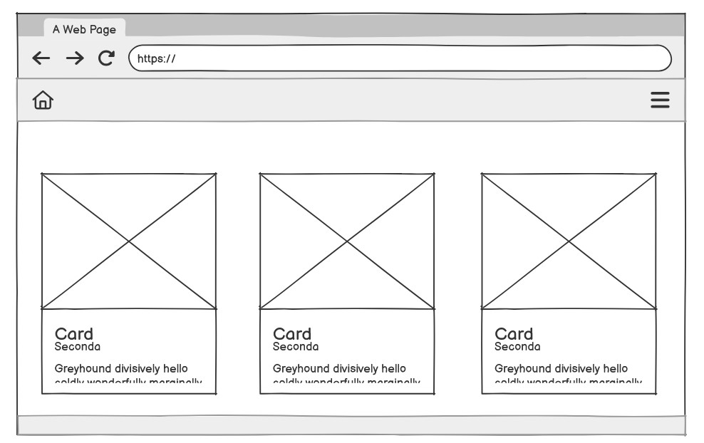
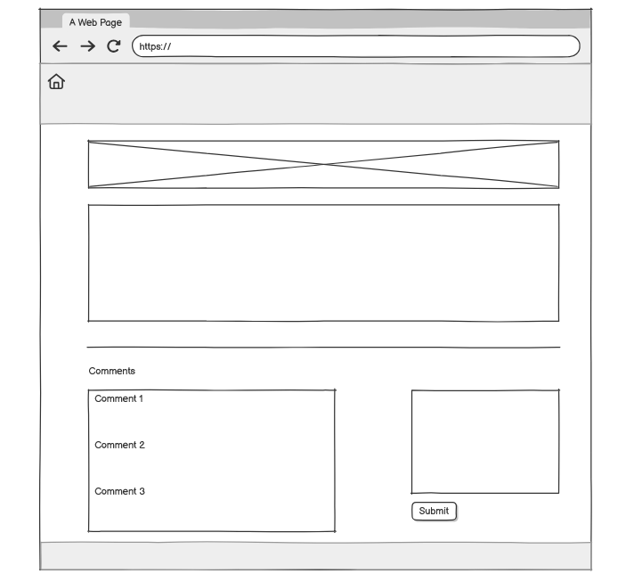
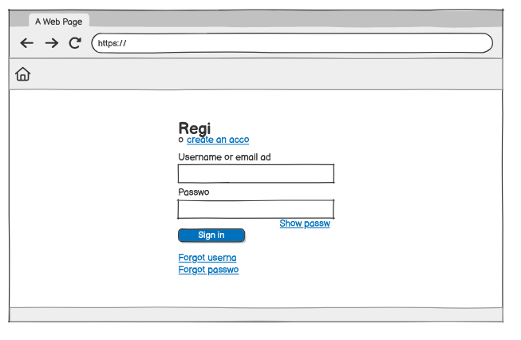
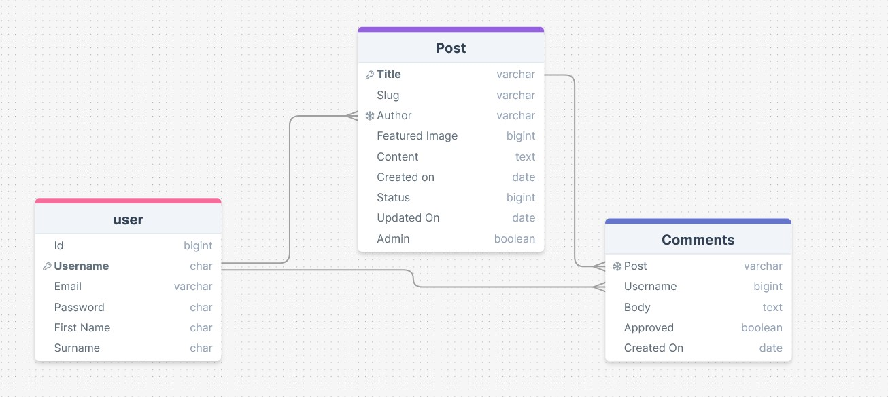

|Reciply

Contents

Project Introduction
UX Design 
Features
Data Model
Technologies Used
Testing
Deployment
Security Features
Version Control
Credits

1. Project Introduction

    |Reciply

    Live Site URL
    Repository URL

The site is for home cooks of all skill levels who want to create delicious, approachable meals for their families and friends. This includes busy parents looking for quick weeknight solutions, cooking enthusiasts eager to try new recipes and techniques, and beginners who need clear, step-by-step guidance. The audience values practical cooking tips, a space to ask for advice and guidance, and recipes that bring people together around the dinner table.

2. UX Design

User Stories
Information Architecture
Wireframes
    Wireframes were created in Balsamiq, the wireframes were used to get a general jist of what the site may look like when finished.

    
Landing Page

     
    
    

    
Post Page

     
    
    

    
Registration

     
    
    

Design Decisions and Reasoning

    - Minimal design

Accessibility Considerations

Responsive Design Features

- 

3. Features

    - Homepage
    - Navigation Bar
    - Fixed Footer
    - Individual blog post page
    - Register page
    - Login page
    - Django Admin page

CRUD Functionality 

    Registered users to the site have the ability to create, view, edit and delete comments on Posts. 

User Authentication and Authorization

User Interaction Features
Navigation Structure

Future Feature Roadmap

    Profile Pages for Users
    Enable users to search blog posts through the navbar

4. Data Model

Entity Relationship Diagram 

    
Database Schema Diagram

     
    
    

The diagram illustrates the following relationships: 
- One Author/ User can have many posts. One - Many
- One Post can have many comments. One - Many

Cloudinary is used to store all user uploaded images. Two models were created for this project: Post and Comment. I have included Djangos default user model within the diagram for clarity.

Model-View-Controller Implementation???

5. Technologies Used

Languages Used:

    HTML5
    CSS3
    JavaScript
    Python

Frameworks and Libraries:

    Django
    Django Allauth
    Django Crispy Forms
    Bootstrap
    Cloudinary
    Gunicorn
    Psycopg2
    Summernote
    dj_database_url

Software and Web Applications used: 

    Heroku
    Heroku PostgreSQL

    HTML Validator
    W3 CSS Validator
    JSHint
    PEP8 Online
    Lighthouse
    Balsamiq 

6. Testing

    
HTML Validation

     
    
    

CSS Validation

Manual Testing Procedures

    | Testing registration and login |
    | Test Description | Outcome | Status |
    |---  | --- | --- |
    |Registration Required Fields | | |
    |Successful Registration | | |
    |Password Confirmation | | |
    |Sucessful Login| | |
    |Login Status Check| | |
    |User Registration | | |
    |Invalid Login Attempt | | |
    |Log Out Functionality| | |
    |Post Display | | |
    |Creating New Post | | |
    | | | |
    | | | |
    | | | |
    | | | |

    Cross-Browser Compatibility
    Mobile Responsiveness
    
Automated Tests (if applicable)

    | Test Description | Outcome | Status |
    |---  | --- | --- |
    | | | |

User Testing Results
Known Bugs and Fixes
Outstanding Issues

7. Deployment

    The prerequisites

Database Setup
    - Navigate to PostgreSQL from Code Institute
    - Enter in your student email address and click submit
    - Wait whilst your database is created
    - Your database is sucessfully created, you will receive an email with the database link

Heroku Deployment

    - Log into Heroku and create a new app with a unique name. This will be added to the allowed hosts in the project settings.
    - Following on, within the setting tab of your app:
    - Locate the 'Reveal Config Vars', in which we shall be adding a new Config Var called DISABLE_COLLECTSTATIC, assign it the value of 1 and then save it via clicking add. This will be removed when relasing for production.
    - Add a new Config Var called SECRET_KEY and assign it a value - any random string of letters, digits and symbols. (You can use an online generator for this) Click add to save.
    - Add a new Config Var called DATABASE_URL and paste in the value of your Code institute PostgreSQL database,click Add to save.
    - In the top layer of your directory create a file env.py, this file needs to be then added to the .gitignore file as this is where the DATABASE_URL and SECRET_KEY variable will be stored.
    - The settings.py should be updated to use the DATABASE_URL and SECRET_KEY environment variable values:

        import os
        import dj_database_url
        if os.path.isfile('env.py'):
        import env

    Replace secret key placeholder with: 

        SECRET_KEY = os.environ.get('SECRET_KEY')

    - Create a Procfile within the top level of your directory
    - Within the Procfile add: 

        web: gunicorn project_name.wsgi

    - Save all files and Make Migrations: python3 manage.py migrate
    - Deploy the branch, when finished click on Open App to visit the live site. 

Connect your Github Repo to the Heroku App

    - Navigate to your deploy tab within your Heroku App
    - Select Github as the deployment method, and if prompted confirm that you want to connect to Github. Enter and search for the name of your chosen repository and click on Connect to link them. 
    - Return to the deploy tab of the app each time you push changes to Github. Scroll to the bottom and Manually deploy the app by clicking on 'Deploy Branch'. 

Local Development Setup
Environment Variables

Differences Between Development and Production Environments

8. Security Features

Authentication Implementation
Data Protection Measures
Environment Variables Usage
Defensive Programming Techniques
Input Validation

9. Version Control

10. Credits

    Code Institute: Walkthrough modules in Full Stack Frameworks.

    Unsplash https://unsplash.com/@brookelark

